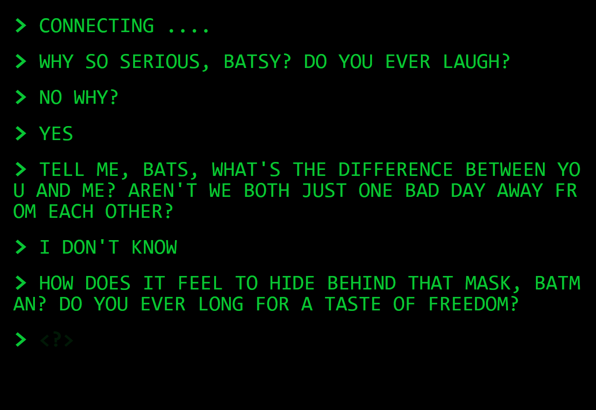

# Radalata

Radalata is an innovative web application developed using Next.js, Socket.io, React, and Next.js. It aims to provide a platform for anonymous messaging worldwide, allowing users to engage in weird and intriguing conversations with anonymous individuals. By leveraging Next.js for server-side rendering and combining it with Socket.io and React for real-time communication, Radalata offers a unique and interactive messaging experience.



## Live Demo
You can access the live demo [here](https://radalata.onrender.com/).

## Description

Radalata is designed to facilitate anonymous messaging and foster open communication between users. The application allows individuals to send and receive weird messages without revealing their identities, creating an atmosphere of mystery and curiosity.

## Features

- Anonymous Messaging: Radalata enables users to engage in anonymous messaging with individuals from around the world. Users can send and receive weird messages without revealing their identities, fostering a sense of intrigue and creativity.

- Real-time Communication: The application utilizes Socket.io to establish real-time, bi-directional communication between users. This enables instant message delivery and updates, providing a dynamic and interactive messaging experience.

- Server-Side Rendering: Next.js is used for server-side rendering, ensuring fast loading times and optimal performance. This allows users to seamlessly access the application and engage in anonymous conversations without delays.

- React Components: Radalata utilizes React for building interactive and reusable user interface components. React's component-based architecture allows for efficient development, making the application more responsive and user-friendly.

## Getting Started

To run the project locally, follow these steps:

1. Clone the repository:

   ```shell
   git clone https://github.com/Emam546/RadaLata
   ```
2. Install the dependencies:

   ```shell
   npm install
   ```

3. Start the development server:

    ```shell
   npm dev
   ```
****